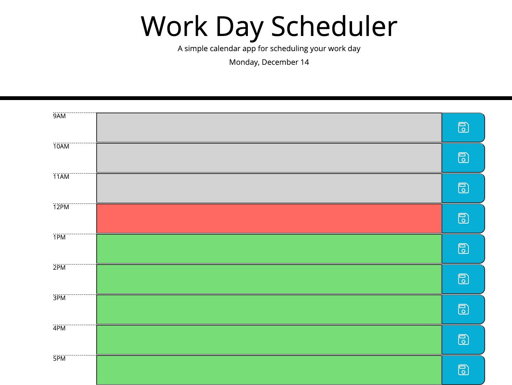
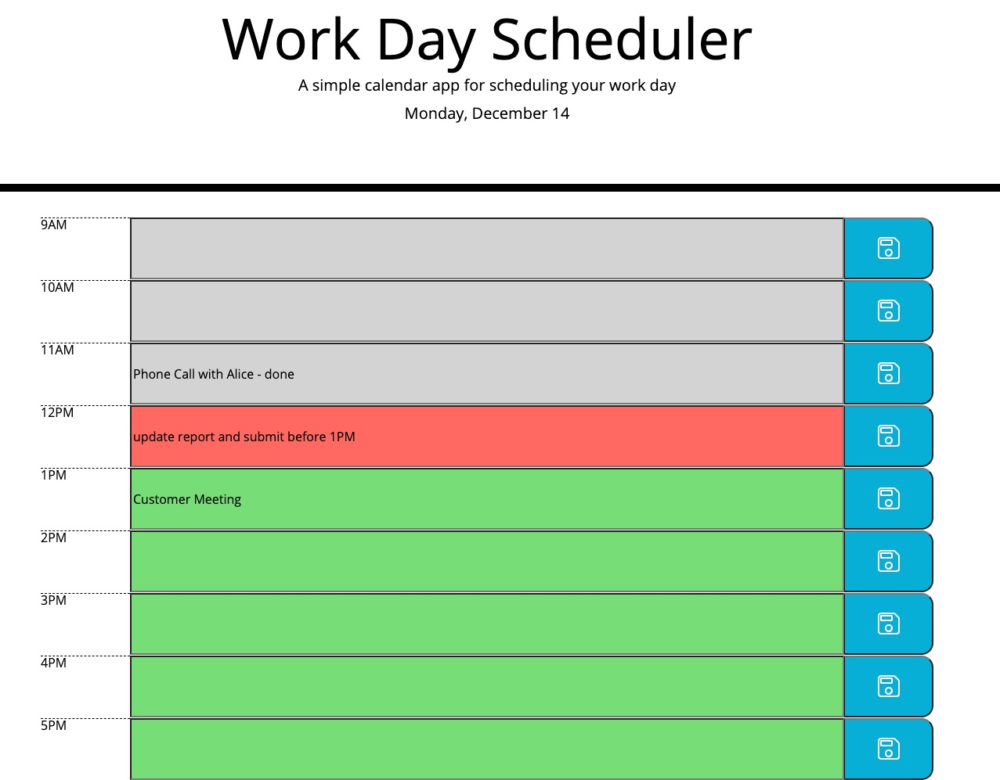

# Work Day Scheduler

## User Story

```
AS AN employee with a busy schedule
I WANT to add important events to a daily planner
SO THAT I can manage my time effectively
```

# Description

This is a simple calendar application that allows a user to save events for each working hour of the day.

User can type in the tasks/events for each hour and then click the save button on the right so the tasks will be saved and are accessbile anytime.

The past timeblocks will be grey color, present timeblock will be red and future timeblocks will be green.

# Screenshots

The following image shows this calendar application's appearance and functionality:




# Links

* The URLs of the deployed website: https://mengyue-z.github.io/Work-Day-Scheduler/

* The URLs of the GitHub repositories: https://github.com/mengyue-z/Work-Day-Scheduler

